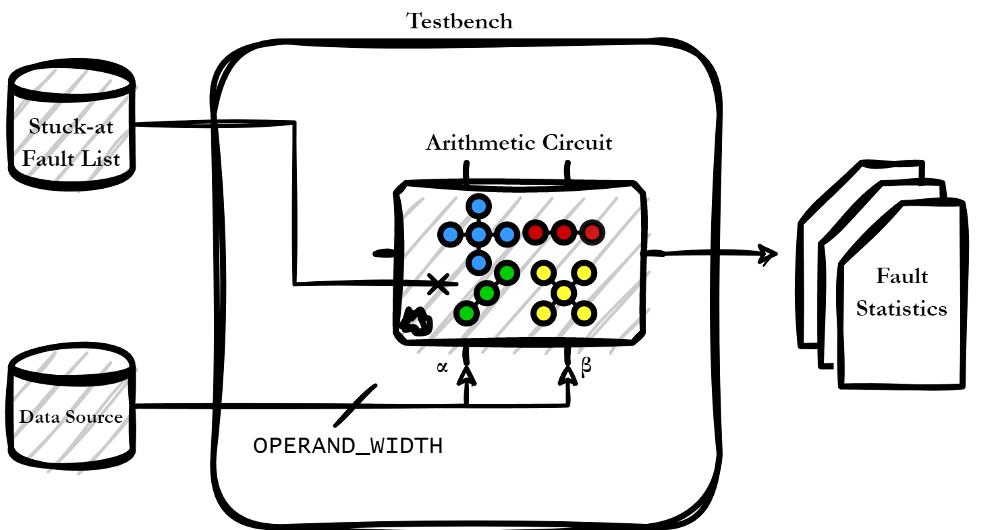

# finjenv: **F**ault **Inj**ection **Env**ironment for Arithmetic Circuits #

Finjenv offers a somewhat modular environment for performing fault injection campaigns of permanent hardware faults (stuck-at) on arithmetic circuits. The fault injection flow is based on the QuestaSIM logic simulator by Siemens EDA.

It was developed for performing fault injection campaigns on integer multiplier circuits in order to perform extensive reliability analysis on their architectural characteristics. More on this here: DOI: [10.1109/DDECS60919.2024.10508899](https://doi.org/10.1109/DDECS60919.2024.10508899).

## Testbench 


The testbench (TB) is responsible of mapping your circuit under test (CUT), performing a full simulation of the source operands which are included in the `.hex` file which is passed via the `+plusarg` at simulation-time to the TB. 

The TB generates two instances of your CUT, one for the Golden Machine (GM) and one for the Faulty Machine (FM). The FM is injected with a stuck-at fault (see [here](scripts/README.md) for more info). These two circuits are used to form a miter circuit which keeps track of the different responses of the two circuits. 

Finally, after all operands have been simulated on the miter circuit, the testbench exports the responses into the `__to_py.csv` file for further processing and error computation.

In this directory there exist 2 variations of the testbench. The first one `tb_comb.sv` regards combinational arithmetic circuits which have:
- 2 primary inputs (one for each operand)
- 1 primary output (the result)

And the two operands have the same width (precision).

The second testbench `tb_nvdla.sv` regards a more complex, mixed-precision sequential circuit which required specific configuration (`sources/circuit_b`), hence further HDL code. It is included as an example of how you can create your own testbenches in case you have a more complicated CUT. :)  

In case you have a circuit however that falls into the first category, you can extend `tb_comb.sv` by inserting your own mapping with the appropriate `+define` and `` `elseif`` compiler directive at the indicated location.


## Makefile ##

Everything is orchestrated via the `Makefile`. The CUT is placed in the `sources` directory and must follow the naming conventions specified [here](sources/README.md).

### Datasets ###
`DATASETS` holds a list of dataset names used for pattern generation. In case you will add more datasets to `input_patterns` then you must extend this list!

### Hex Pattern Files ###
For each input pattern `.csv` file, the corresponding `.hex` file must be generated via the [`2hex.py`](input_patterns/2hex.py) utility. Based on your arithmetic circuit `precision` and type (e.g., `nvdla`) the suffix of the generated `hex` files changes. 

For instance if your circuit is using the first testbench variation (`tb_comb.sv`) and uses 32-bit input operands then its hex files' suffixes will be `32bit.hex`. If on the other hand your circuit requires some special formating of the `hex` file as explained [here](input_patterns/README.md) and as is done for the `--nvdla` case, then the output filename will be `32bit-[custom_flag].hex`. Both variations are included in the `Makefile` for your own convenience :). 

You have to specify which are the expected hex files to be present during compilation. For each new circuit `x`, the corresponding `CIRCUIT_x_HEX` statement must be added to the `Makefile`. Respect the naming convetion and use a lowercase character only for the circuit letter.

### Circuit Definitions ###
Compilation definitions for each circuit, including top-level module and precision settings. Note that in the case that your testbench will be `tb_comb.sv`, then the defines `OPERAND_WIDTH` and `RESULT_WIDTH` which correspond to the input bits and the output bits of your CUT, are mandatory!

For each new circuit `x`, the corresponding `CIRCUIT_x_DEF` statement must be added to the `Makefile`. Respect the naming convention and use a lowercase character only for the circuit letter.

### Pattern Conversion Rules ###
These rules convert CSV pattern files to hex files using [`2hex.py`](input_patterns/2hex.py)

Can be invoked as 
```
make input_patterns/[source_basename].[precision]bit
```
Example:
```
make input_patterns/lenet5_sample.32bit.hex
```
Will generate the 32-bit hex file from the `lenet5_sample.csv` source.

These rules are all invoked by the `generate_hex/circuit_%` recipe which matches the `%` character to the corresponding `CIRCUIT_x_HEX` list of files. 

### Compilation and Fault Injection Rules ###

These are the two main recipes that are specific to each CUT. For a circuit `x` you should create the:
1. `compile/circuit_x/%: generate_hex/circuit_x` 
2. `fault_inject/circuit_x/%: compile/circuit_x/%` 

Few adjustments must be performed on each recipe however.

#### Compilation ####
Let's use as an example the recipe for circuit b. 
```
compile/circuit_b/%: generate_hex/circuit_b
	@{ \
		FILENAME=$(basename $*)                                          ;\
		OPERANDS=$$(wc -l < $(ROOT_DIR)/input_patterns/$*)               ;\
->		mkdir -p run/circuit_b/$$FILENAME                                ;\
->		cd run/circuit_b/$$FILENAME                                      ;\
		cp $(ERROR_SCRIPT) .                                             ;\
		$(VLIB) $(WORK_LIB_DIR)                                          ;\
		$(VLOG) -work $(WORK_LIB_DIR) -sv +define+functional $(TECH_LIB) ;\
->		$(VLOG) -work $(WORK_LIB_DIR) $(VLOG_FLAGS) $(CIRCUIT_b_DEF)      \
			+define+TOTAL_OPERS=$$OPERANDS                                \
->			$(ROOT_DIR)/sources/circuit_b/gate                            \
->			$(ROOT_DIR)/tb_nvdla.sv                                      ;\
		$(VOPT) -work $(WORK_LIB_DIR) $(VOPT_FLAGS) $(TOP_NAME)           \
			-o $(addsuffix _vopt, $(TOP_NAME))                           ;\
	}
```
The lines beginning with `->` must be updated with your own circuit letter and of course the respective testbench at the very bottom.

#### Fault Simulation ####
Let's use again as an example the recipe for circuit b. 

```
fault_inject/circuit_b/%: compile/circuit_b/%
	@{ \
		FILENAME=$(basename $*)                                                      ;\
->		cd run/circuit_b/$$FILENAME                                                  ;\
->		export _FAULT_LIST=$(ROOT_DIR)/sources/circuit_b/flist                       ;\
		export _FAULT_INDEX=$(FAULT_IDX)                                             ;\
		export _MODE=$(MODE)                                                         ;\
		$(VSIM) -c -work $(WORK_LIB_DIR) -quiet -suppress 3691                        \
->			"+operands_filename=$(ROOT_DIR)/input_patterns/$$FILENAME.8bit-nvdla.hex" \
		$(addsuffix _vopt, $(TOP_NAME))                                               \
			-do "source $(ROOT_DIR)/scripts/fault_simulation.tcl"                    ;\
	}	
```

The lines beginning with `->` must be updated with your own circuit letter. Also, the on the last `->` be careful to add the correct `hex` file suffix to the `+plusarg`! Otherwise you will have errors during runtime! 

## Citations

You can reference finjenv by using the following @misc entry in Bibtex
```
@misc{misc:finjenv,
    author       = "{Deligiannis, I. Nikolaos}",
    title        = "{finjenv: Fault Injection Environment for Arithmetic Circuits}",
    howpublished = "\url{https://github.com/NikosDelijohn/finjenv}",
    year         = "2024"
}
```
## Index
- [About Input Sources](input_patterns/README.md)
- [About Circuit Sources](sources/README.md)
- [About Operational Scripts](scripts/README.md)
